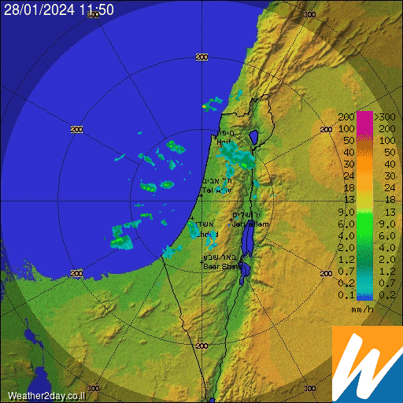
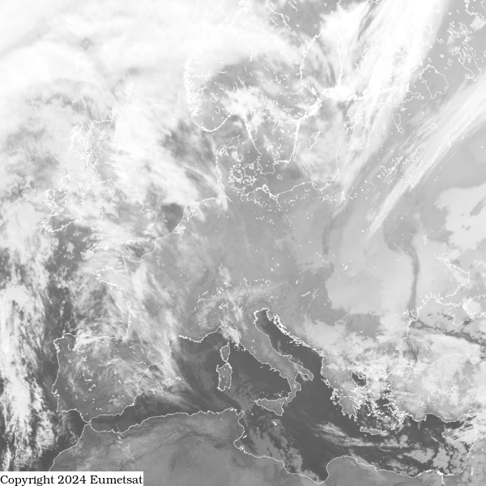
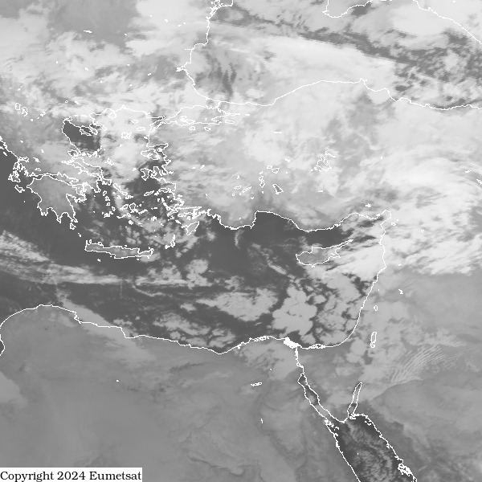

# ims-radar-service
Small python service to serve ims rain radar and satellite images for Home-Assistant and other systems

[מכ"מ גשם](https://ims.techblog.co.il/radar)

[לוויין מזג אויר אירופה](https://ims.techblog.co.il/eu-sat)

[לוויין מזג אויר ישראל](https://ims.techblog.co.il/me-sat)

