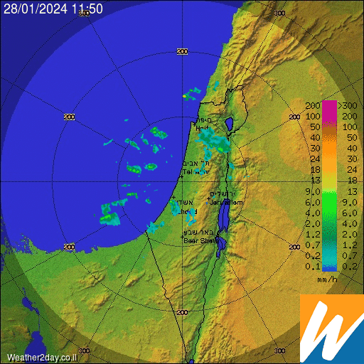
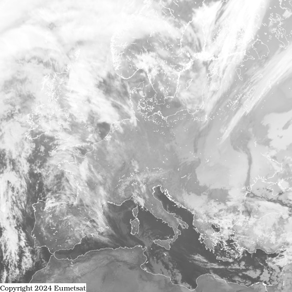
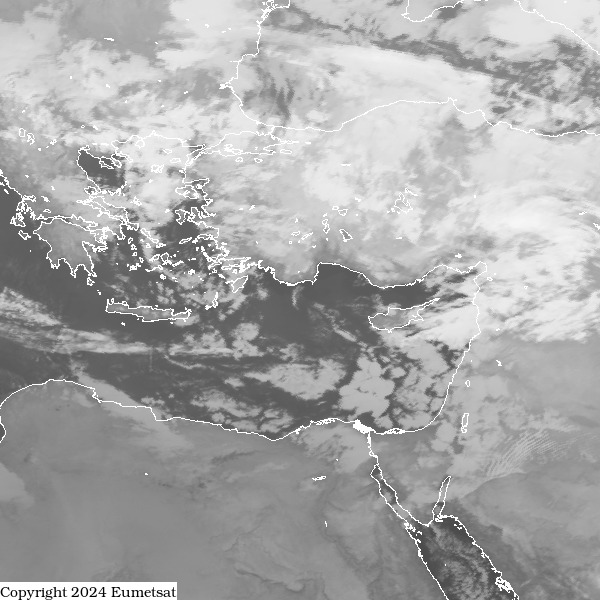
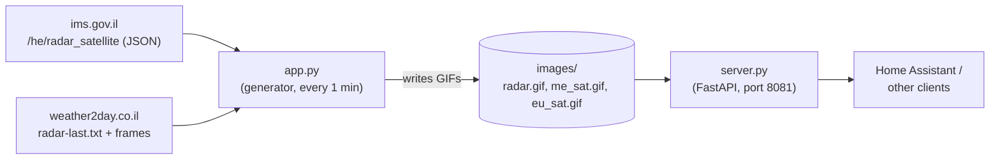

# ims-radar-service

A small Python service that builds animated GIFs of the Israeli rain radar and of weather
satellite imagery (Middle East and Europe), and serves them over HTTP so Home Assistant and
other systems can show them.

The satellite frames come from the [Israel Meteorological Service (IMS)](https://ims.gov.il)
website. The rain radar frames come from [weather2day.co.il](https://www.weather2day.co.il).

> **Unofficial project.** This project is not affiliated with, endorsed by, or supported by the
> Israel Meteorological Service or weather2day. It downloads images that those sites publish.
> Check each site's terms of use before you use or redistribute the images.

## Table of contents

- [Examples](#examples)
- [Features](#features)
- [How it works](#how-it-works)
- [Requirements](#requirements)
- [Installation and running](#installation-and-running)
- [Configuration](#configuration)
- [API endpoints](#api-endpoints)
- [Home Assistant integration](#home-assistant-integration)
- [Troubleshooting](#troubleshooting)
- [Security notes](#security-notes)
- [Development](#development)
- [Contributing](#contributing)
- [License](#license)

## Examples

The images below are sample outputs committed to the repository (`app/images/`). Each link
points to the author's public instance of the service.
<!-- TODO: verify - https://ims.techblog.co.il returned HTTP 526 (Cloudflare: invalid origin SSL certificate) on 2026-09-29 -->

[מכ"מ גשם (rain radar)](https://ims.techblog.co.il/radar)



[לוויין מזג אויר אירופה (Europe satellite)](https://ims.techblog.co.il/eu-sat)



[לוויין מזג אויר ישראל (Middle East satellite)](https://ims.techblog.co.il/me-sat)



## Features

- Builds three animated GIFs:
  - `radar.gif`: rain radar over Israel (up to the 22 most recent weather2day radar frames).
  - `me_sat.gif`: Middle East satellite loop from IMS.
  - `eu_sat.gif`: Europe satellite loop from IMS.
- Is designed to rebuild all three GIFs once at startup and then every minute.
  **Currently broken:** with the current IMS JSON format no GIFs are rebuilt, and the
  committed samples are what gets served. See [Troubleshooting](#troubleshooting).
- Serves the GIFs over HTTP with FastAPI on port `8081`.
- Fits any client that can show an image from a URL, such as a Home Assistant camera or a
  dashboard card.

## How it works

The service is two separate processes that share the `images/` directory:


```mermaid
flowchart LR
    IMS["ims.gov.il<br/>/he/radar_satellite (JSON)"] --> G
    W2D["weather2day.co.il<br/>radar-last.txt + frames"] --> G
    G["app.py<br/>(generator, every 1 min)"] -->|writes GIFs| D[("images/<br/>radar.gif, me_sat.gif, eu_sat.gif")]
    D --> S["server.py<br/>(FastAPI, port 8081)"]
    S --> HA["Home Assistant /<br/>other clients"]
```

1. **Generator (`app/app.py`)**
   - Fetches `https://ims.gov.il/he/radar_satellite`, a JSON document that lists the satellite
     frames. It takes the file names under `data.types.MIDDLE-EAST` and `data.types.EUROPE` and
     prefixes them with `https://ims.gov.il`.
   - Fetches `https://www.weather2day.co.il/radar-last.txt`, takes its first 22 lines, reverses
     them, and prefixes each with `https://www.weather2day.co.il/images/radar/`.
   - Downloads every frame to the system temp directory, builds the GIF with `imageio`
     (infinite loop), and then deletes the downloaded frames (`app/radar_satellite.py`).
   - Uses [`schedule`](https://pypi.org/project/schedule/) to run the job once at startup and
     then every minute.
2. **Server (`app/server.py`)**
   - A FastAPI app, run by uvicorn on `0.0.0.0:8081`, that returns the GIFs from `images/`.

The GIFs are written to `images/` relative to the **current working directory** if that
directory exists, and otherwise next to `radar_satellite.py`. The server always reads from
`images/` relative to the current working directory. Run both processes from the `app/`
directory so they use the same folder.

## Requirements

- Python 3 <!-- TODO: verify the minimum supported Python version -->
- Outbound HTTPS access to `ims.gov.il` and `www.weather2day.co.il`
- The Python packages the code imports (there is no `requirements.txt` in the repository):

| Package (PyPI) | Imported as | Used by |
|---|---|---|
| `requests` | `requests` | `app.py`, `radar_satellite.py` |
| `schedule` | `schedule` | `app.py` |
| `loguru` | `loguru` | all modules |
| `imageio` | `imageio` | `radar_satellite.py` |
| `Pillow` | `PIL` | `radar_satellite.py` |
| `pygifsicle` | `pygifsicle` | `radar_satellite.py` (imported, not called) |
| `fastapi` | `fastapi`, `starlette` | `server.py` |
| `uvicorn` | `uvicorn` | `server.py` |

## Installation and running

No Docker image or GitHub release is published for this project, so run it from source:

```bash
git clone https://github.com/t0mer/ims-radar-service.git
cd ims-radar-service/app

python3 -m venv .venv
. .venv/bin/activate
pip install requests schedule loguru imageio Pillow pygifsicle fastapi uvicorn

# Terminal 1: generate the GIFs (runs forever, refreshes every minute)
python app.py

# Terminal 2: serve the GIFs on port 8081
python server.py
```

Both commands must run from the `app/` directory (see [How it works](#how-it-works)). The
repository already contains sample GIFs in `app/images/`, so the server has something to return
before the first generation finishes. A successful generator run overwrites them.

> **Currently broken:** with the current IMS JSON format, `app.py` fails before it writes any
> GIF, so the server keeps returning the committed samples. See
> [Troubleshooting](#troubleshooting).

To keep the service running, start both processes with a process manager such as systemd or
supervisord. The repository does not include unit files for them.

## Configuration

The service has no configuration file, command-line flags, or environment variables. Every
setting is hard-coded:

| Setting | Value | Where |
|---|---|---|
| HTTP listen address | `0.0.0.0` | `app/server.py` |
| HTTP port | `8081` | `app/server.py` |
| Refresh interval | once at startup, then every 1 minute | `app/app.py` |
| IMS satellite index | `https://ims.gov.il/he/radar_satellite` | `app/app.py` (`radar_url`) |
| IMS image base URL | `https://ims.gov.il` | `app/app.py` (`images_url`) |
| Radar frame list | `https://www.weather2day.co.il/radar-last.txt` | `app/app.py` (`weather2day_images_url`) |
| Radar frame base URL | `https://www.weather2day.co.il/images/radar/` | `app/app.py` (`weather2day_base_url`) |
| Number of radar frames | 22 | `app/app.py` |
| Output directory | `images` (relative to the working directory) | `app/radar_satellite.py` |
| GIF frame duration | `10` (passed to `imageio.mimsave`) <!-- TODO: verify whether imageio treats this as seconds or milliseconds for the installed version --> | `app/radar_satellite.py` |

To change a value, edit the source file.

## API endpoints

| Method | Path | Returns |
|---|---|---|
| `GET` | `/radar` | `images/radar.gif`: rain radar loop |
| `GET` | `/me-sat` | `images/me_sat.gif`: Middle East satellite loop |
| `GET` | `/eu-sat` | `images/eu_sat.gif`: Europe satellite loop |

If a GIF does not exist yet, the endpoint returns HTTP `200` with a JSON body instead of an
image:

```json
{"error": "Image not found on the server"}
```

FastAPI also serves its default interactive docs at `/docs` and `/redoc`, and the schema at
`/openapi.json`.

Example:

```bash
curl -o radar.gif http://localhost:8081/radar
```

## Home Assistant integration

The endpoints return plain image files, so the **Generic Camera** integration can show them.
Add one camera per image:

1. Go to **Settings → Devices & services → Add integration → Generic Camera**.
2. Set **Still image URL** to one of:
   - `http://<host>:8081/radar`
   - `http://<host>:8081/me-sat`
   - `http://<host>:8081/eu-sat`
3. Leave **Stream source URL** empty. Turn off **Verify SSL certificate** only if you put the
   service behind HTTPS with a self-signed certificate.

Then show the camera on a dashboard, for example with a picture-entity card:

```yaml
type: picture-entity
entity: camera.radar   # the entity ID Home Assistant created
camera_view: auto
show_state: false
```

<!-- TODO: verify that Home Assistant plays the GIF animation through the camera proxy rather than showing only the first frame -->

If you only need the image on a dashboard, a **Picture** card whose image is
`http://<host>:8081/radar` also works, as long as the browser can reach the service.

## Troubleshooting

- **No GIFs are generated, or they stop updating.** The generator reads
  `data.types.MIDDLE-EAST` and `data.types.EUROPE` from the IMS JSON. If IMS changes that
  structure, the job fails before it writes any GIF (including the radar GIF) and logs
  `Error getting images.` As of 2026-09-29, the IMS response has the keys `IMSRadar`, `radar`,
  and `satellite` under `data.types`, so the current code no longer finds the satellite frames.
  <!-- TODO: verify and update app.py for the current IMS JSON format -->
- **An endpoint returns `{"error": "Image not found on the server"}`.** The GIF does not exist in
  `images/` under the server's working directory. Start `server.py` from `app/`, and check that
  `app.py` also runs from `app/` and has completed at least one run.
- **The server serves old images.** Most likely the IMS format change described above: the
  generator fails before writing any GIF, so the server keeps returning the committed samples.
  Otherwise, `app.py` and `server.py` may use different working directories, so the generator
  writes to a different `images/` folder.
- **Errors in the log.** Every download or GIF error is logged with loguru to stderr. Look for
  `Error getting data.`, `Error getting images.`, or `Error creating <file> animation.`

## Security notes

- The server has no authentication and listens on all interfaces (`0.0.0.0`). Expose it only on
  a trusted network, or put it behind a reverse proxy with TLS and access control.
- The interactive FastAPI docs (`/docs`, `/redoc`) are enabled.
- The service needs outbound access only to `ims.gov.il` and `www.weather2day.co.il`.

## Development

Project layout:

```text
app/
├── app.py              # generator: fetches frame lists and rebuilds the GIFs every minute
├── radar_satellite.py  # RadarSatellite: downloads frames and writes the animated GIFs
├── server.py           # FastAPI server on port 8081
└── images/             # sample / generated GIFs (radar.gif, me_sat.gif, eu_sat.gif)
```

The repository has no tests, linters, CI workflows, or Dockerfile.

## Contributing

Issues and pull requests are welcome at
[github.com/t0mer/ims-radar-service](https://github.com/t0mer/ims-radar-service).

## License

The repository has no `LICENSE` file, so no license has been granted for the code.
The radar and satellite images belong to their sources (IMS and weather2day) and are subject to
those sites' terms of use.
